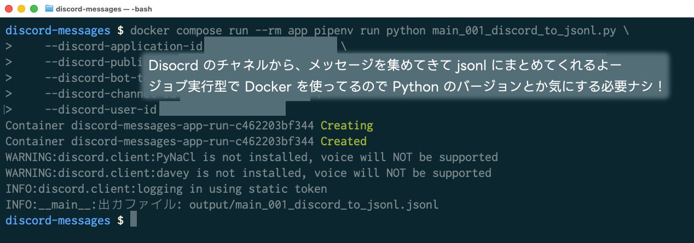
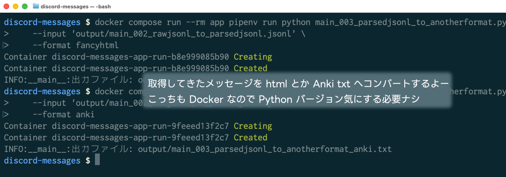
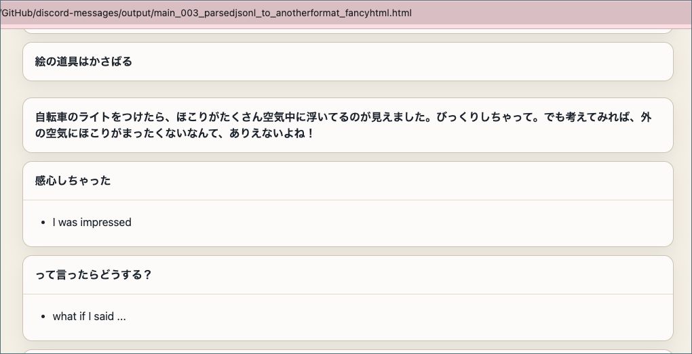
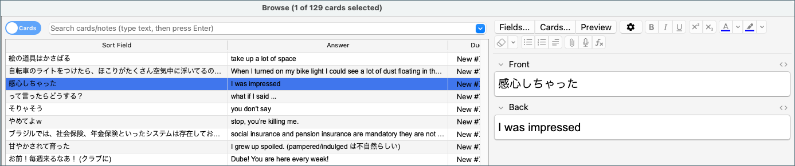

discord-messages
===

今回のオモチャがやること

- Discord のチャネルからメッセージを獲ってきて、整形して、別のフォーマット (html とか Anki txt) へコンバートする
- まあ正直 html はオマケで、メインは Anki txt だよね

今回のオモチャのウリ

- Docker を使っているので、 Python バージョン気にする必要ナシ!
- Docker ジョブ実行型で使うのにちょっと慣れてきた。普段は常駐サービスばっかりだもんね
- 「メッセージ取得」「整形」「コンバート」を 001, 002, 003 という別スクリプトにしてるのは分かりやすい
- 「整形」スクリプトに parser 引数用意してるのクールすぎ (まあ default しか用意してないけど)
- 「コンバート」スクリプトに format 引数用意してるのもクールすぎ (いまのとこ fancyhtml, anki)









## dev note

- Discord Application の作成が必要: https://discord.com/developers/applications
- Bot Token も必要。このとき Message Content Intent ON が必要。
- Discord 側で developer mode ON が必要: https://qiita.com/ymzkjpx/items/8f42733d0fb67d454e27

```bash
docker compose up --detached --build
docker compose run --rm app pipenv install --dev
docker compose run --rm app pipenv install --dev ruff
docker compose run --rm app pipenv install discord.py
# モジュール入れたら build し直してねー。
```

## How to start

```bash
# 最初のセットアップ
# いつもは up -d --build してるけど、それはサーバとかウェブアプリのため (常駐サービス型)
# 今回はそれぞれのスクリプトを単発で動かすだけで、最初のビルドは pipenv と dependencies を用意するのだけが目的 (ジョブ実行型) なので build だけでいいよ
docker compose build

# Ruff を動かしてみる
docker compose run --rm app pipenv run ruff check .
docker compose run --rm app pipenv run ruff check --fix .

# Python スクリプトを動かしてみる
# NOTE: いやー、このスクリプトは秘密情報多いからここには書けないや。 help コマンドだけここに置いとくよ。
docker compose run --rm app pipenv run python main_001_discord_to_jsonl.py --help
docker compose run --rm app pipenv run python main_002_rawjsonl_to_parsedjsonl.py --help
docker compose run --rm app pipenv run python main_003_parsedjsonl_to_anotherformat.py --help
```

## コミット前確認

```bash
docker compose run --rm app pipenv run ruff check .

# discover: テストを自動探索
# -s tests: テストが入っているディレクトリ
# -v: verbose
docker compose run --rm app pipenv run python -m unittest discover -s tests -v
```
